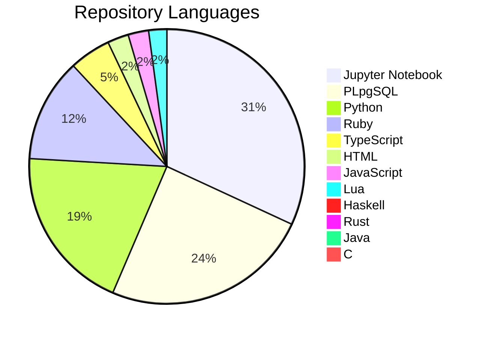

```mermaid
pie title Repository Languages
    "Jupyter Notebook" : 14047
    "PLpgSQL" : 10796
    "Python" : 8580
    "Ruby" : 5362
    "TypeScript" : 2143
    "HTML" : 1095
    "JavaScript" : 1061
    "Lua" : 939
    "Haskell" : 435
    "Rust" : 181
    "Java" : 116
    "C" : 100
```
